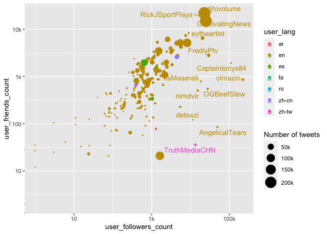
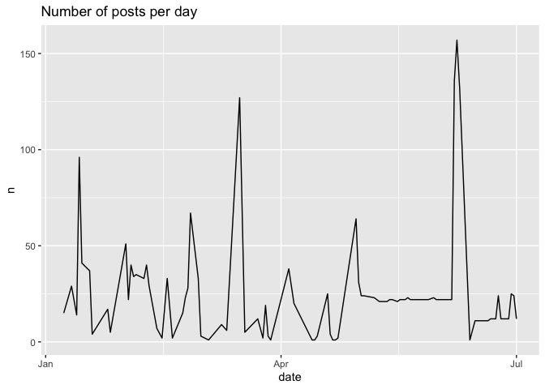
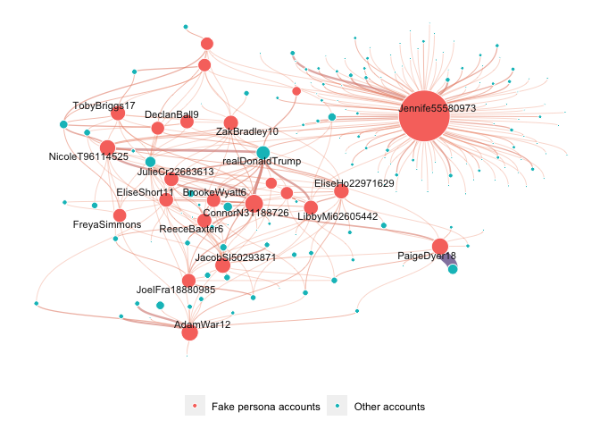
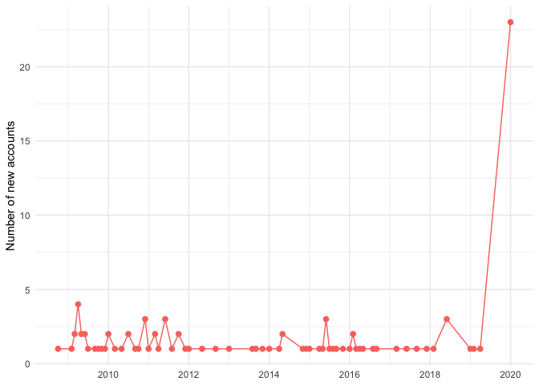
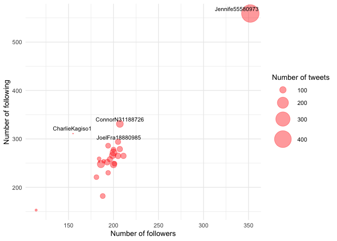

Iran Twitter Analysis
================

``` r
library(DBI)
library(bigrquery)
library(tidyverse)
library(dbplyr)
library(lubridate)
library(tidytext)
library(igraph)
library(ggraph)
library(graphlayouts)
```

Authentication hidden

``` r
dbListTables(con)
```

    ## [1] "blm_hashtags"           "blm_mentions"           "blm_tweets"            
    ## [4] "blm_urls"               "covid1948_accounts"     "iran_blm_092020_tweets"

``` r
tweets <- tbl(con, "blm_tweets") 
```

``` r
data <- 
  tweets %>% 
  distinct() %>% 
  # mutate(retweet_screen_name = str_extract(full_text, "(?<=RT @).*?(?=: )")) %>% 
  collect()
```

``` r
data %>% 
  count(user_id_str, user_screen_name, user_followers_count, user_friends_count) %>% 
  summarize(
    users = n(), 
    average_posts = mean(n, na.rm = TRUE), 
    follower = mean(user_followers_count, na.rm = TRUE), 
    following = mean(user_friends_count, na.rm = TRUE)
  )
```

    ## # A tibble: 1 x 4
    ##   users average_posts follower following
    ##   <int>         <dbl>    <dbl>     <dbl>
    ## 1   244         8402.    3313.     1230.

``` r
data %>% 
  count(user_id_str, user_screen_name, user_followers_count, user_friends_count, user_lang) %>% 
  ggplot(aes(user_followers_count, user_friends_count, color = user_lang)) + 
  geom_point(aes(size = n)) + 
  ggrepel::geom_text_repel(
    aes(label = user_screen_name), 
    data = . %>% filter(user_followers_count > 10000)
    ) + 
  scale_x_log10(labels = function(x) if_else(x < 999, as.character(x), str_c(x/1000, "k"))) + 
  scale_y_log10(labels = function(x) if_else(x < 999, as.character(x), str_c(x/1000, "k"))) + 
  scale_size_continuous(
    labels = function(x) str_c(x/1000, "k"), range = c(0.2, 8), 
    name = "Number of tweets"
    ) 
```

    ## Warning: Transformation introduced infinite values in continuous x-axis

    ## Warning: Transformation introduced infinite values in continuous y-axis

<!-- -->

``` r
data %>% 
  top_n(10, wt = retweet_count) %>% 
  arrange(desc(retweet_count))
```

    ## # A tibble: 10 x 30
    ##    id_str user_id_str user_name user_screen_name user_location user_description
    ##    <chr>  <chr>       <chr>     <chr>            <chr>         <chr>           
    ##  1 11552… 8059332881… frankk 🌹 whitegayrab      ucsb zoom     "🇸🇾 | parody ac…
    ##  2 12110… 22720093    Craig Ma… clmazin          La Cañada Fl… "Writer-Produce…
    ##  3 12425… 22720093    Craig Ma… clmazin          La Cañada Fl… "Writer-Produce…
    ##  4 12534… 22720093    Craig Ma… clmazin          La Cañada Fl… "Writer-Produce…
    ##  5 12377… 22720093    Craig Ma… clmazin          La Cañada Fl… "Writer-Produce…
    ##  6 11391… 7022702692… Reggie A… kingviralposts   With Your Bi… "Life's a Box o…
    ##  7 12899… 22720093    Craig Ma… clmazin          La Cañada Fl… "Writer-Produce…
    ##  8 12392… 22720093    Craig Ma… clmazin          La Cañada Fl… "Writer-Produce…
    ##  9 12356… 22720093    Craig Ma… clmazin          La Cañada Fl… "Writer-Produce…
    ## 10 12769… 22720093    Craig Ma… clmazin          La Cañada Fl… "Writer-Produce…
    ## # … with 24 more variables: user_url <chr>, user_followers_count <int>,
    ## #   user_friends_count <int>, user_created_at <dttm>, user_lang <chr>,
    ## #   lang <chr>, full_text <chr>, created_at <dttm>, source <chr>,
    ## #   in_reply_to_userid_str <chr>, in_reply_to_status_id_str <chr>,
    ## #   quoted_status_id_str <chr>, retweeted <lgl>,
    ## #   retweeted_status_user_id_str <chr>, retweeted_status_id_str <chr>,
    ## #   latitude <chr>, longitude <chr>, quote_count <int>, reply_count <int>,
    ## #   favorite_count <int>, retweet_count <int>, hashtags <chr>, urls <chr>,
    ## #   user_mentions <chr>

``` r
retweet_data <- 
  data %>% 
  filter(retweeted == TRUE) %>% 
  mutate(retweet_screen_name = str_extract(full_text, "(?<=RT @).*?(?=: )"))

retweet_data %>% 
  count(user_screen_name, sort = TRUE)
```

    ## # A tibble: 228 x 2
    ##    user_screen_name      n
    ##    <chr>             <int>
    ##  1 djhivolume       100466
    ##  2 KDonMusik         52046
    ##  3 kingviralposts    32419
    ##  4 MarkusMcLaughln   29089
    ##  5 immisterg         22372
    ##  6 ulthoetaeks       18769
    ##  7 PonyBoy636        16638
    ##  8 lilxicanita       14415
    ##  9 RickJSportPlays   11582
    ## 10 ellerandall        9249
    ## # … with 218 more rows

``` r
retweet_data %>% 
  filter(user_screen_name == "KDonMusik") %>% 
  count(retweet_screen_name, sort = TRUE)
```

    ## # A tibble: 837 x 2
    ##    retweet_screen_name     n
    ##    <chr>               <int>
    ##  1 DJJohnnyO           29464
    ##  2 DJHIVOLUME           7475
    ##  3 ChieMoney             988
    ##  4 PhenomRadio           880
    ##  5 DjDewBaby             710
    ##  6 DjChieMoney           654
    ##  7 mmindsmusic           625
    ##  8 RadioKingzRadio       582
    ##  9 TEMPIREMG             570
    ## 10 SlateStoneMusic       431
    ## # … with 827 more rows

\#\#\#Users created in Jan 2020

``` r
data %>%
  mutate(user_created_at = as.Date(user_created_at)) %>% 
  filter(
    month(user_created_at) == 01, 
    year(user_created_at) == 2020
  ) %>% 
  distinct(user_screen_name)
```

    ## # A tibble: 24 x 1
    ##    user_screen_name
    ##    <chr>           
    ##  1 ConnorN31188726 
    ##  2 Jennife55580973 
    ##  3 LibbyMi62605442 
    ##  4 DeclanBall9     
    ##  5 BrookeWyatt6    
    ##  6 LucyHig29027248 
    ##  7 EliseHo22971629 
    ##  8 AdamWar12       
    ##  9 KeiraRowley     
    ## 10 TobyCooke8      
    ## # … with 14 more rows

``` r
journo_ids <- readxl::read_xlsx("final_user_list.xlsx", sheet = 2) %>% pull(userid)

journos <- 
  data %>% 
  filter(user_id_str %in% journo_ids)

journo_names <- journos %>% distinct(user_screen_name) %>% pull()

journos_inter <- 
  journos %>% 
  select(user_screen_name, full_text) %>% 
  unnest_tokens(interactions, full_text, token = "tweets", strip_punct = FALSE, to_lower = FALSE) %>% 
  filter(str_detect(interactions, "@")) %>% 
  mutate(interactions = str_remove_all(interactions, "@"))
```

``` r
journos %>% 
  count(date = floor_date(created_at, "days")) %>% 
  ggplot(aes(date, n)) + 
  geom_line() + 
  labs(
    title = "Number of posts per day"
  )
```

<!-- -->

``` r
interactions <- 
  journos_inter %>% 
  count(user_screen_name, interactions, sort = TRUE) 

node_weights <- 
  rbind(
    interactions %>% select(-interactions) %>% rename(user = user_screen_name), 
    interactions %>% select(-user_screen_name) %>% rename(user = interactions)
  ) %>% 
  group_by(user) %>% 
  summarize(n = sum(n)) %>% 
  arrange(desc(n))
```

    ## `summarise()` ungrouping output (override with `.groups` argument)

``` r
min_edges <- 2

nodes <- 
  journos_inter %>% 
  count(user_screen_name, interactions, sort = TRUE) %>% 
  filter(n >= min_edges) %>%
  select(-n) %>% 
  gather(value = "id") %>%
  distinct(id) %>%
  left_join(node_weights, by = c(id = "user")) %>% 
  mutate(account = if_else(id %in% journo_names, "Fake persona accounts", "Other accounts"))

edges <- 
  journos_inter %>%
  count(user_screen_name, interactions, sort = TRUE) %>%
  rename(
    source = user_screen_name, 
    target = interactions, 
    weight = n
  ) %>% 
  filter(weight >= min_edges) 

graph <- graph_from_data_frame(edges, nodes, directed = TRUE)
```

``` r
#good ones: dh, graphopt, 
# png("plots/fake_network.png", width = 8 , height = 6, units = "in", res = 300)

set.seed(1234)
ggraph(graph, layout = "dh") + 
  geom_edge_diagonal(aes(edge_width = weight, edge_color = weight), show.legend = FALSE, alpha = 0.6) +
  geom_node_point(aes(size = n, fill = account), alpha = 1, shape = 21, color = "white") + 
  scale_size(range = c(0.5, 20)) + 
  geom_node_text(aes(filter = n > 70, label = name), repel=TRUE, color = "gray10", size = 3) + 
  scale_edge_width_continuous(range = c(0.2, 4)) + 
  scale_edge_colour_gradient(high = "#3d1e71", low = "#f19879") + 
  scale_fill_discrete(name = NULL) + 
  theme(
    panel.background = element_rect(fill = "white"),
    legend.position = "bottom"
  ) + 
  guides(
    size = FALSE
  )
```

<!-- -->

``` r
# dev.off()
```

``` r
final_accounts_id <- readxl::read_xlsx("final_user_list.xlsx", sheet = 3) %>% pull(userid)

final_accounts <- 
  data %>% 
  filter(user_id_str %in% final_accounts_id)

# png("plots/account_creation_date.png", width = 8 , height = 6, units = "in", res = 300)

final_accounts %>% 
  distinct(user_screen_name, user_created_at) %>% 
  mutate(user_created_at = as.Date(user_created_at)) %>% 
  count(date = floor_date(user_created_at, "months")) %>% 
  ggplot(aes(date, n)) + 
  geom_line(color = "#F8766D") + 
  geom_point(color = "#F8766D", size = 2) + 
  scale_x_date(date_labels = "%Y", date_breaks = "2 year") + 
  labs(
    x = NULL, 
    y = "Number of new accounts"
  ) + 
  theme_minimal()
```

<!-- -->

``` r
# dev.off()
```

``` r
# png("plots/fake_account_stats.png", width = 8 , height = 6, units = "in", res = 300)

journos %>% 
  count(user_id_str, user_screen_name, user_followers_count, user_friends_count, user_lang) %>% 
  ggplot(aes(user_followers_count, user_friends_count)) + 
  geom_point(aes(size = n), alpha = 0.4, color = "red") + 
  ggrepel::geom_text_repel(
    aes(label = user_screen_name), 
    data = . %>% filter(user_friends_count > 290),
    size = 3, 
    nudge_y = 10
  ) + 
  scale_x_continuous(labels = function(x) if_else(x < 999, as.character(x), str_c(x/1000, "k"))) + 
  scale_y_continuous(labels = function(x) if_else(x < 999, as.character(x), str_c(x/1000, "k"))) + 
  scale_size_continuous(
    # labels = function(x) str_c(x/1000, "k"), 
    range = c(0.2, 12), 
    name = "Number of tweets"
  ) + 
  labs(
    x = "Number of followers",
    y = "Number of following"
  ) + 
  theme_minimal()
```

<!-- -->

``` r
# dev.off()
```
